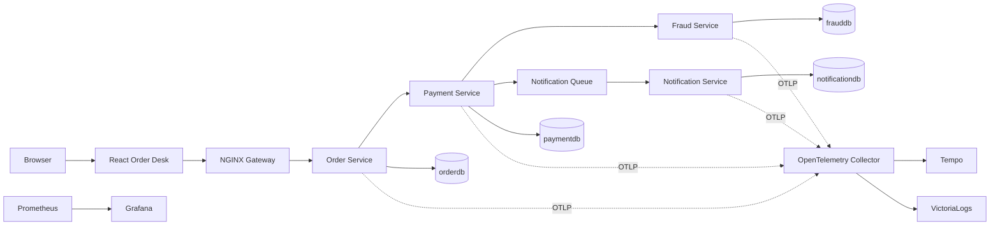

# Project Architecture

## Runtime Shape

Docker Compose runs four Spring Boot 3.3 / Java 21 services, PostgreSQL 16,
NGINX, and the telemetry stack. Each service owns a separate database
(`orderdb`, `paymentdb`, `frauddb`, and `notificationdb`). The React/Vite client
is served by NGINX in the frontend container and proxies `/api/` to the gateway;
the gateway routes each API prefix to its owning service.

## Request Flows

1. The React dashboard dispatches Redux Toolkit thunks to `GET /api/orders`,
   `GET /api/orders/statistics`, `POST /api/orders`, or the cancellation route.
2. NGINX forwards the request to Order Service. Order Service validates the
   create DTO, persists the order, and calls Payment Service inside its current
   transaction. The payment result determines `PAID` or `PAYMENT_FAILED`.
3. Payment Service calls Fraud Service synchronously because it needs a verdict.
   Notifications are enqueued and processed asynchronously so notification work
   does not hold up the payment response.
4. Micrometer tracing propagates trace context over HTTP; services export spans
   to the OTel Collector. Metrics flow through Prometheus and logs through the
   collector to VictoriaLogs. Grafana dashboards consume the telemetry stores.

## Data and API Design

`OrderController` maps a create DTO to the JPA entity rather than trusting
client-supplied IDs/status. Its list endpoint is server-paged and supports
status, customer, item-name, and allow-listed sort filters. Page size is bounded
to 100; statistics are queried separately so dashboard totals are not limited
to the visible page. The repositories use Spring Data JPA; Hibernate currently
manages schema updates with `ddl-auto: update`, which is convenient for this
sandbox but should become versioned migrations before production.

The other service APIs are documented in [API.md](API.md). Their collection
endpoints are not yet consistently paged. There is no production user/account
model, JWT issuer/verifier, password hashing, or role enforcement. The browser
login and protected route are illustrative only. A production implementation
must secure every externally reachable service, not only hide React routes, and
must propagate identity/service credentials over both synchronous and queued
calls.

## Operational Trade-offs

- The order-to-payment call currently occurs inside a database transaction. It
  is easy to reason about in this demo, but holds a connection/transaction open
  across network I/O and is not a distributed transaction. Production options
  include an outbox plus saga/state machine, idempotency keys, and compensating
  actions.
- The notification queue is in-process and bounded, not durable. A process restart
  can lose queued work; use a durable broker when delivery guarantees matter.
- `findAll`-style collections in payment/fraud/notification can grow without
  bound. Those APIs need pagination, stable ordering, and indexes aligned with
  their filters before production traffic.
- Add measured caching only for read paths with clear invalidation rules. Order
  status and payment decisions are mutable and should not be cached casually.
- Docker Compose is the local deployment boundary; container health and
  downstream readiness should be checked before declaring a full stack healthy.

## Source Map

- Order HTTP/DTO/paging: [OrderController.java](../microservices/order/src/main/java/com/example/orderservice/controller/OrderController.java)
- Order persistence/query: [OrderRepository.java](../microservices/order/src/main/java/com/example/orderservice/repository/OrderRepository.java)
- Order workflow: [OrderService.java](../microservices/order/src/main/java/com/example/orderservice/service/OrderService.java)
- Gateway routes: [nginx.conf](../gateway/nginx.conf)
- Compose runtime: [docker-compose.yml](../docker-compose.yml)
- React routes: [App.jsx](../frontend/src/App.jsx)
- Redux async state: [ordersSlice.js](../frontend/src/features/orders/ordersSlice.js)
- Dashboard/API controls: [OrderDashboard.jsx](../frontend/src/pages/OrderDashboard.jsx)
- Telemetry pipeline: [OTel Collector config](../observability/otel-collector/otel-collector-config.yaml), [Prometheus config](../observability/prometheus/prometheus.yml)